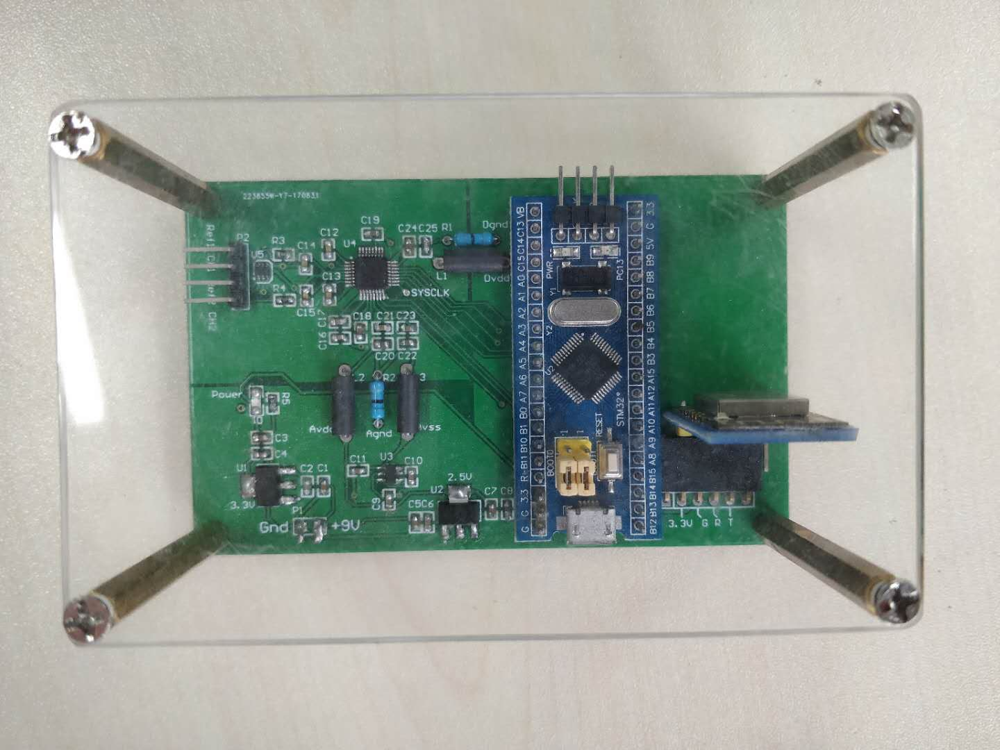
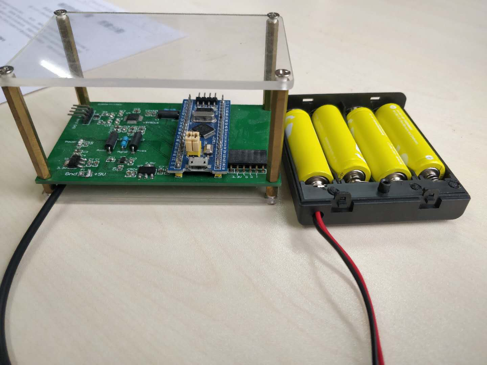
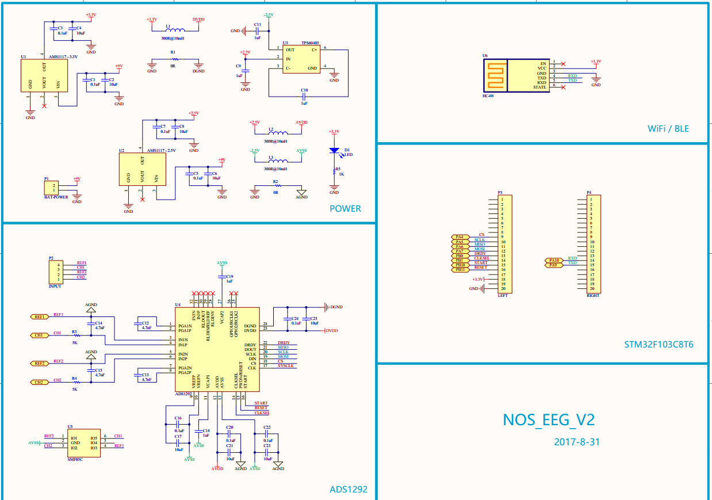
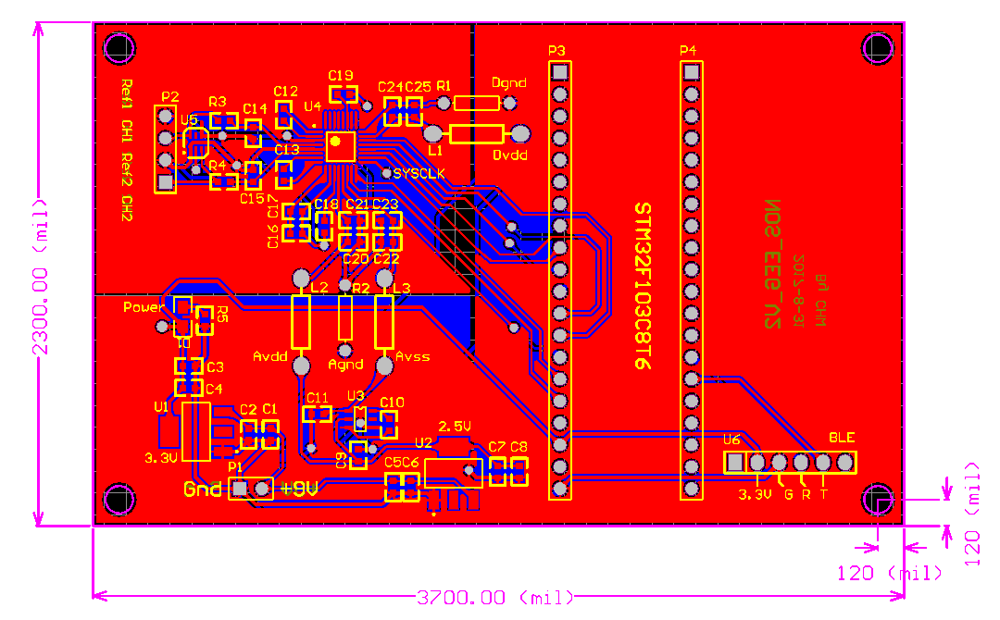

# OpenSSVEP

Software and hardware for a single channel BCI (Brain Computer Interface) based on SSVEP (Steady State Vision Evoked Potential).


[Youku video demo](https://v.youku.com/v_show/id_XMzA5NDg0MzY3Mg==.html)

## Motivation

This project was for 2017 National Undergraduate Biomedical Engineering Innovation Design Competition. This project shows the possiblity of low cost and somewhat convenient device for BCI based on OpenSSVEP. Further development may lead to a useable low cost SSVEP based BCI device, along with software targeted at all platform.

Highlights:

- Overall cost for hardware under 100CNY.
- easy to reproduce hardware design.
- The stimuli do not require strict blinking frequency timing.
- further investigation on data analysis method can improve detection accuracy.
- plug-in wireless modules

  use wifi or BLE or anything you like, with modification on embedded software

Hardware:









## Project Layout

```
.
├── firmware            -- embedded software
├── NOS_EEG_V2          -- PCB
├── utils               -- command line utilities
├── openSSVEP           -- software for stimuli presentation, real time analysis and offline analysis
├── sample_data         -- sample data to play with
├── requirement.txt     -- python dependencies
├── README.md
└── LICENSE
```

## Stimuli

First select 3 frequency that activate strong power in corresponding frequency band in frequency domain

Now we have 3 frequency that can act as 3 distinct instructions. But how can we get enough number of instructions to cover a keyboard?
Well, we can achieve more distince instructions with combination of these 3 frequency.

Given frequency f1, f2 and f3, we can use f1->f2->f3 as an instruction, and f2->f1->f3 as another.
In this way, we can get as many as 27(3x3x3) instructions.

In short, we achieve more instructions with a reduce in input speed.

## Detection algorithm

Based on short time fourier transform(STFT). Can be improved with wavelet transform or Hilbert-Huang transform.

## Software

Software is composed of two part: real-time data analysis and stimuli presentation. Both are GUI software implemented with python kivy.

Further GUI development can shift to webGL or any web based technique.

### Denpendency Installation

This project is targeted at python3, so you would have to install python3 first.

1. Before installing required packages, install `wheel`.

```sh
$ pip install wheel
```

1. Install dependencies using requirement.txt:

```sh
$ pip install -r ./requirement.txt
```

1. Install kivy garden dependency of matplotlib.

```sh
$ garden install matplotlib --upgrade
```

## Reference

[1]吴俊平. 脑—机接口中的 SSVEP 信号处理方法研究[D]. 华南理工大学, 2015.
[2]胡俊. 基于时频编码的 SSVEP 在线系统开发[D]. 电子科技大学, 2013.
[3]Wu Z, Su S. A Dynamic Selection Method for Reference Electrode in SSVEP-Based BCI[J]. Plos One, 2014, 9(8):e104248.
[4]黄漫玲, 吴平东, 毕路拯,等. 闪光视觉诱发电位在脑机接口中的应用研究[J]. 计算机应用与软件, 2009, 26(11):13-16.
[5]Frey J. Comparison of an open-hardware electroencephalography amplifier with medical grade device in brain-computer interface applications[C]// International Conference on Physiological Computing Systems. 2016:105-114.
[6]Cheng M, Gao X, Gao S, et al. Design and implementation of a brain-computer interface with high transfer rates[J]. IEEE transactions on bio-medical engineering, 2002, 49(10):1181.
[7]Ko L W, Ranga S S K, Komarov O, et al. Development of Single-Channel Hybrid BCI System Using Motor Imagery and SSVEP[J]. Journal of Healthcare Engineering, 2017, 2017:1-7.
